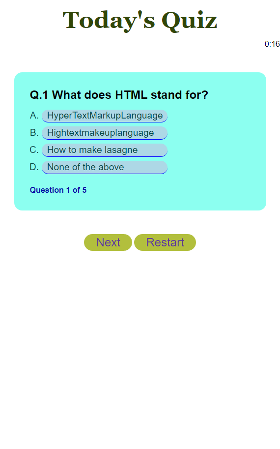

# challenge4

# challenge3

## Description

We were given task to make a quiz and create a countdown timer, as well as a highscore.
I did struggle for time this week, however I did what I could in the time given. 
As we learned all the necessary parts in the week just gone, however to put them into application in the format of a quiz was really difficult to guage. I unfortunately ran out of personal time to create a Highscore and getlocalstorage function in Javascript.
I understand this is an important part, may be able to have time with a resubmission, however this is all I can manage for now.
I have however still created a quiz that can go from one box to another with the clicking submission.
I have also included a countdown timer, that alerts saying time is up, however it doesn't stop the user from scoring currently.
Issues I am yet to fix:
Highscore window, Restart button (currently not active), this was supposed to operate in the circumstance timer runs out. I was unsuccessful in getting the timer to be the score also.
## Installation

N/A

## Usage

https://daleduiv.github.io/challenge4/

## Credits
  https://www.youtube.com/watch?v=v7rSSy8CaYE
  Timer Countdown assist: https://stackoverflow.com/questions/61179765/javascript-timer-countdown 
## License

MIT License

## Badges

N/A

## Features

N/A

## How to Contribute

N/A
## Tests

N/A

